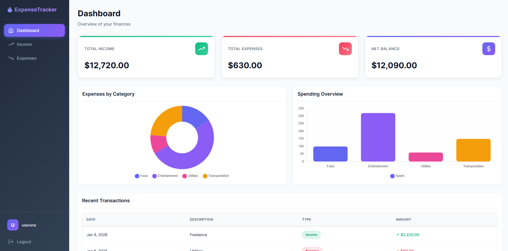
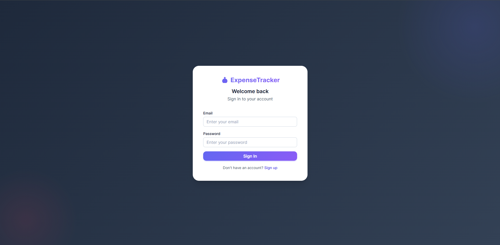
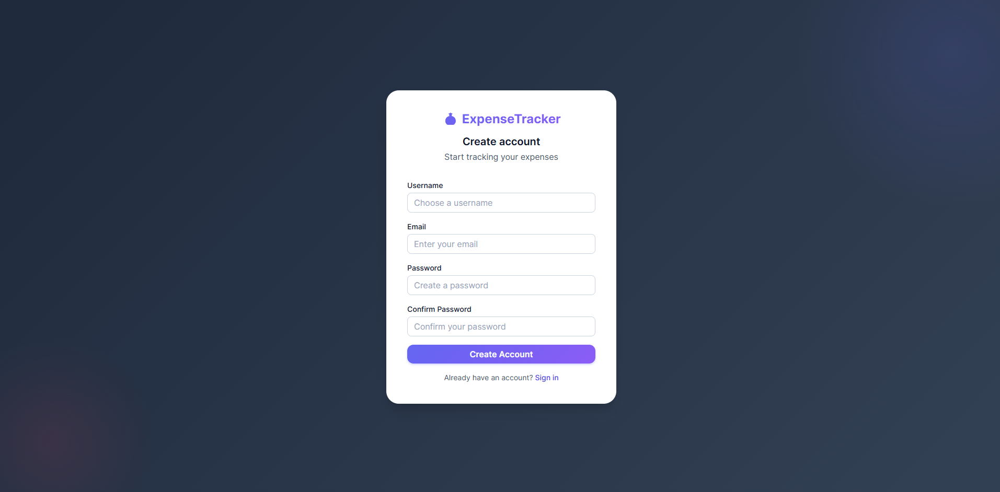
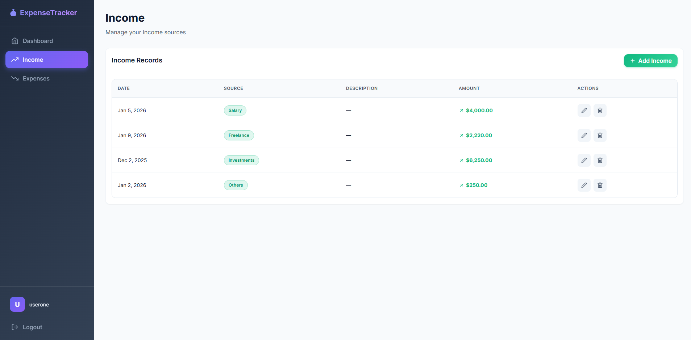
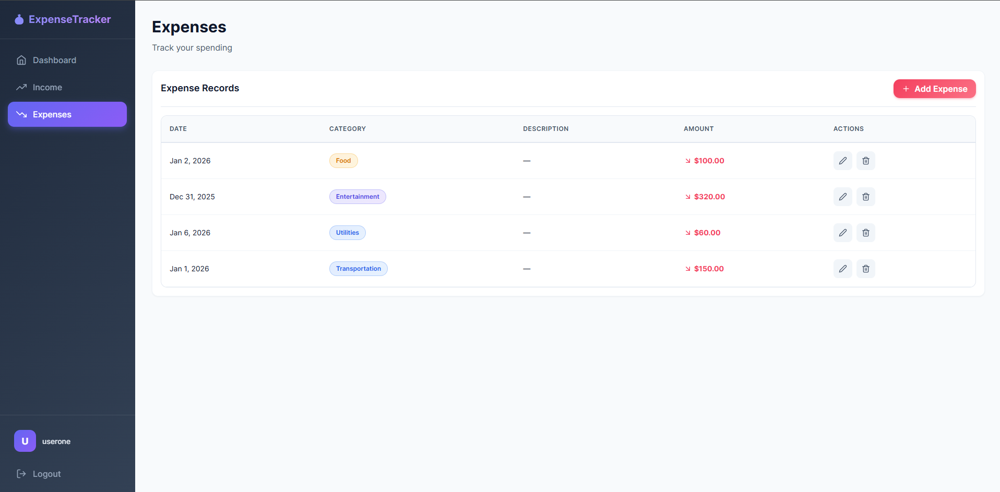

<div align="center">

# 💰 Expense Tracker

### Take Control of Your Finances

A modern, full-stack expense tracking application with beautiful UI and powerful analytics.

[](https://reactjs.org/)
[](https://nodejs.org/)
[](https://mongodb.com/)
[](https://styled-components.com/)

<br />



</div>

---

## ⚡ Quick Overview

<table>
<tr>
<td width="50%">

### 🎯 What it does

- Track **income** from multiple sources
- Monitor **expenses** by category  
- Visualize spending with **interactive charts**
- View **real-time balance** updates
- Secure **JWT authentication**

</td>
<td width="50%">

### 🛠️ Built with

- **Frontend:** React, Styled Components, Chart.js
- **Backend:** Node.js, Express.js
- **Database:** MongoDB with Mongoose
- **Auth:** JWT tokens

</td>
</tr>
</table>

---

## 📸 Screenshots

<div align="center">
<table>
<tr>
<td width="50%" align="center">

<br />
<strong>🔐 Login</strong>
</td>
<td width="50%" align="center">

<br />
<strong>📝 Sign Up</strong>
</td>
</tr>
<tr>
<td width="50%" align="center">

<br />
<strong>💵 Income Management</strong>
</td>
<td width="50%" align="center">

<br />
<strong>💳 Expense Tracking</strong>
</td>
</tr>
</table>
</div>

---

## 🚀 Getting Started

```bash
# Clone the repo
git clone https://github.com/yourusername/expense_tracker_platform.git

# Install dependencies
cd server && npm install
cd ../client && npm install

# Start backend (terminal 1)
cd server && npm start

# Start frontend (terminal 2)
cd client && npm start
```

> 📍 App runs at `http://localhost:3000` | API at `http://localhost:5000`

---

## 📁 Project Structure

```
📦 expense_tracker_platform
├── 🎨 client/                # React Frontend
│   └── src/
│       ├── components/       # UI Components
│       ├── pages/            # Page Views
│       ├── services/         # API Calls
│       └── styles/           # Theme System
│
└── ⚙️ server/                # Node.js Backend
    ├── controllers/          # Business Logic
    ├── models/               # Data Models
    ├── routes/               # API Routes
    └── middleware/           # Auth Layer
```

---

## 🔌 API Reference

| Method | Endpoint | Description |
|:------:|----------|-------------|
| `POST` | `/users/register` | Create account |
| `POST` | `/users/login` | Sign in |
| `GET` | `/income/:userId` | Fetch income |
| `POST` | `/income/add` | Add income |
| `PUT` | `/income/:id` | Update income |
| `DELETE` | `/income/:id` | Remove income |
| `GET` | `/expenses/:userId` | Fetch expenses |
| `POST` | `/expenses/add` | Add expense |
| `PUT` | `/expenses/edit/:id` | Update expense |
| `DELETE` | `/expenses/delete/:id` | Remove expense |

---

<div align="center">

### 🌟 Star this repo if you found it helpful!

Made with ❤️ and lots of ☕

</div>
